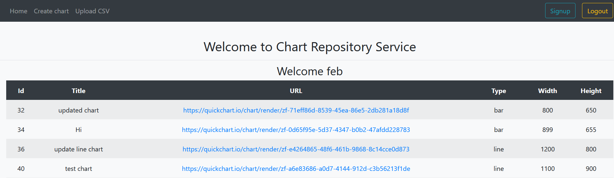
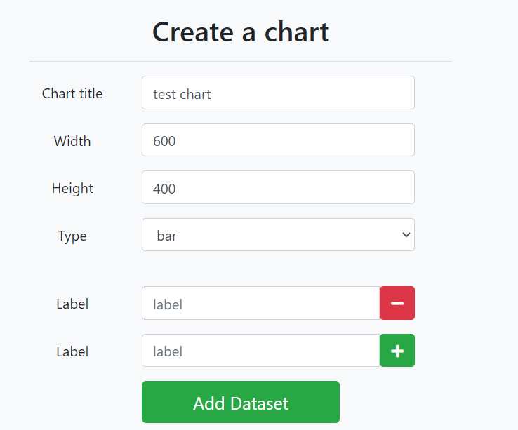
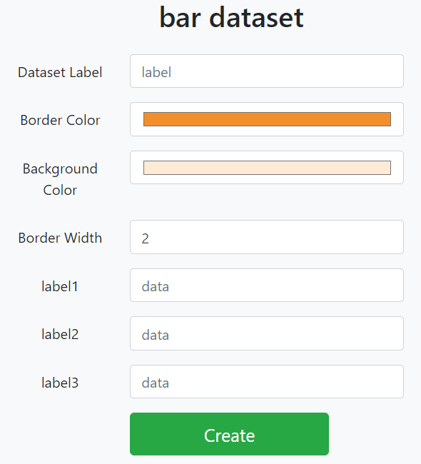
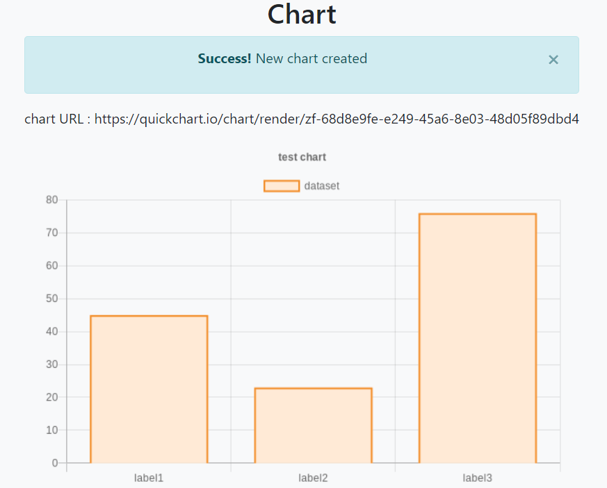
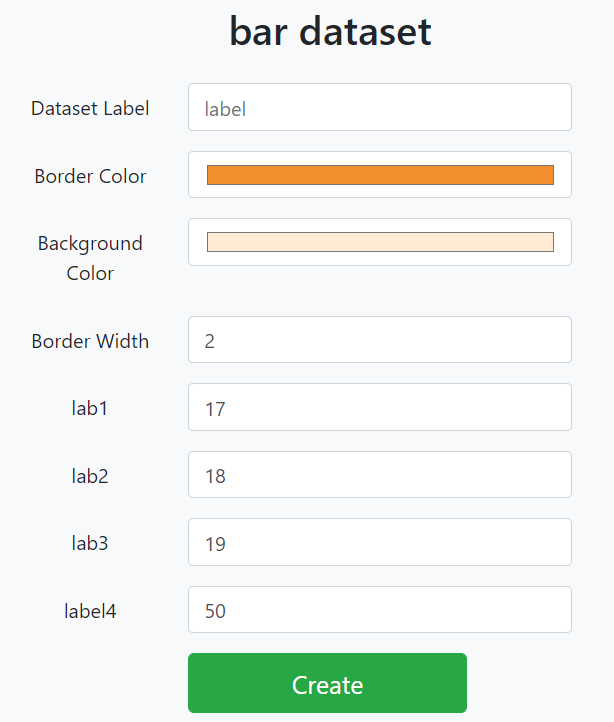
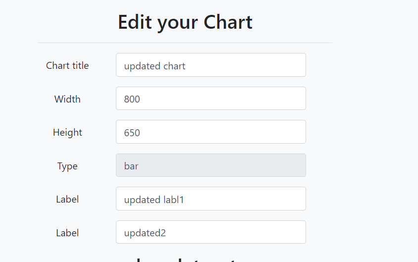
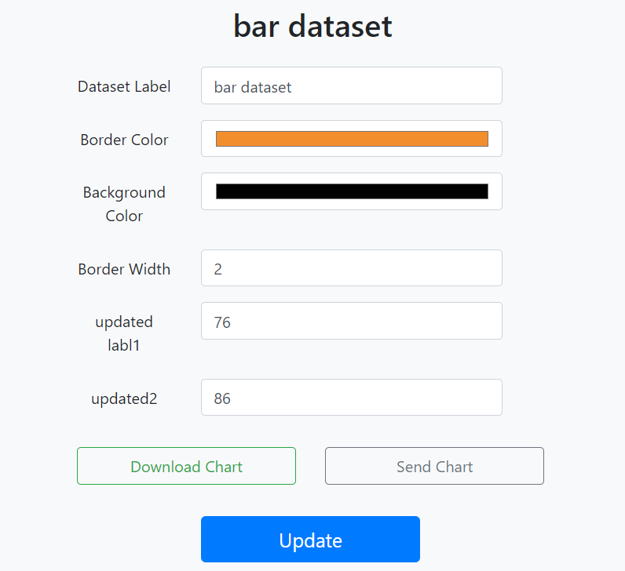
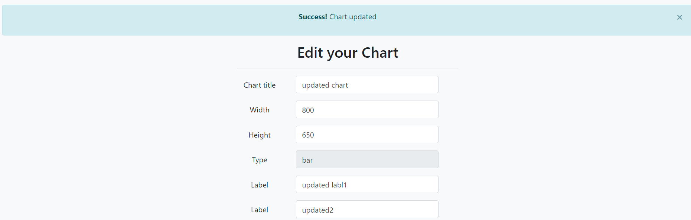

# SOEN-487-A3

Web-Application that integrates the QuickChart API and allows a client to create a custom chart. Implements CRUD requests following MVC Pattern and RESTful architecture.Uses Spring security to maintain a secure web service (uses Login/Logout features). Controller allows for Response to return JSON for Postman Requests and HTTP to web browser.

## Created By
Ivan Gerasymenko, Febrian Francione, Kiho Lee

## Built With
* [Java](https://www.java.com/en/) - Backend programming
* [Spring framework](https://spring.io/) - Backend framework (Spring Boot)
* [Spring Security](https://spring.io/projects/spring-security) - Spring Security
* [MySql](https://www.mysql.com/) - Database
* [Maven](https://maven.apache.org/) - Dependency Management
* [Thymeleaf](https://www.thymeleaf.org/) - Front End Templating with HTML and CSS
* [Bootstrap 4](https://getbootstrap.com/) - Responsive Front End CSS framework
* [Font Awesome](https://fontawesome.com/) - Open Source icon set and toolkit

## Installation and Configuration

This maven project is built using Spring Boot. The core framework and additional libraries were generated with Spring initializr.

The additional dependencies added to the pom.xml file are:

* QuickChart
* sendgrid-java
* spring-security-test
* mysql-connector-java

The web service generates charts and uses persistence through MySQL database. In order to connect
to the database and make SQL transactions please use the following configuration settings:

* Hostname: 127.0.0.1
* Port: 3306
* Username: root
* Password: 1234

The Database Schema to create the database and the tables is provided in the file: src/main/java/com/quickChart/persistence/database.sql

You only need to execute the SQL statements in any Database Management system and it will generate the Database.

The Web Service runs on the local port 8080.

To start the service compile and execute the class: QuickChartApplication.java
Once the Spring Boot loads all the executables and launches the Tomcat Server container you can access the main page of the application with the base url: http://localhost:8080/

This will bring you to the login authentication page, where the user needs to provide his credentials to use the services.

The database already comes pre-populated with a demo user, to login please use the following credentials:

* Username: feb
* Password: 1234

## Documentation

Following are the main entry points of the Web Service which are processed by the controller.
These are all Spring Boot Controller methods that route the response to a Thymeleaf View following the MVC pattern.

All the methods produce :

`{MediaType.APPLICATION_JSON_VALUE}`

Base url: 

* http://localhost:8080/chart

### Home Page

After logging in the controller returns the view Home with a list of all the user charts and linked urls to view and edit a specific chart

* Request URL: `/`

* Method:  `GET`

* URL Params: None

* Data Params: None

* Success Response:
    * Status Code: 200
    * Content : HTML code with a tabular list of charts
      

* Error Response:
    * Status Code: 302
    * Content : Redirect to login if unauthorized access

### Post Form - Chart

When clicking on Create Chart on the navigation bar of the web client, the controller redirects to the View CreateChart with basic form fields of a chart entity

* Request URL: `/PostForm`

* Method:  `GET`

* URL Params: None

* Data Params: None

* Success Response:
  * Status Code: 200
  * Content : HTML code with a form and input fields of a chart Entity
    

* Error Response:
  * Status Code: 302
  * Content : Redirect to login if unauthorized access

### Post Form - Dataset

Receives chart entity with pre-populated chart fields and redirects to a dynamic Thymeleaf template based on chart type with the corresponding dataset entity fields.

* Request URL: `/createDataSet`

* Method:  `POST`

* URL Params: None

* Data Params: Chart entity:
  ```json
  {
      "title" : "title",
      "width" : 600,
      "height" : 400,
      "type" : "bar",
      "labels" : [ "label1", "label2", "label3" ] 
  }
  ```

* Success Response:
  * Status Code: 200
  * Content : HTML code with a form and input fields of a chart Entity and Dataset fields
    

* Error Response:
  * Status Code: 302
  * Content : Redirect to login if unauthorized access

* Notes:
  * if there is a RedirectView from the `uploadFile` method, it will take the chart entity generated in from that method and populate the entity conditionally with the CSV data uploaded

### Create Chart

Receives Chart and DataSet entities from the form and calls QuickChart API to generate chart and persists data to database.
It routes to the view Chart with the chart entity object

* Request URL: `/createChart`

* Method:  `POST`

* URL Params: None

* Data Params: Chart entity with DataSet entity:
  ```json
  {
      "title" : "title",
      "width" : 600,
      "height" : 400,
      "type" : "bar",
      "labels" : [ "label1", "label2", "label3" ], 
      "dataSet" : {
        "label" : "dataset",
        "border_color" : "#F28E2B",
        "background_color" : "#FFEAD6",
        "borderWidth" : 2,
        "data" : [45, 23, 76]
      }
  }
  ```
  
* Success Response:
  * Status Code: 200
  * Content : HTML code with the chart image and url from QuickChart API
    

* Error Response:
  * Status Code: 302
  * Content : Redirect to login if unauthorized access
  
### Upload CSV data

When user clicks Upload CSV he is redirected to the UploadFile form, which is the same as the CreateChart form.
The difference is that here all the labels and data will be uploaded directly from a CSV file

* Request URL: `/upload`

* Method:  `POST`

* URL Params: None

* Data Params: Chart entity with CSV multipart param:
  ```json
  {
      "title" : "title",
      "width" : 600,
      "height" : 400,
      "type" : "bar"
  }
  ```
  
  `file=[MultipartFile]`


* Success Response:
  * Content : redirects to `/createDataSet` which will populate the Dataset labels and data dynamically from CSV and return HTML form
    

* Error Response:
  * Status Code: 302
  * Content : Redirect to login if unauthorized access


* Notes:
  * The CSV file must have the following format
    * 1 header row with one or more columns with the text *{[ "label", "value"]}
    * 1 row with one or more columns corresponding to the header *{[ label, value]}
    * the number of columns must match the number of headers
    * a sample csv file can be found in the documentation folder [CSV file](documentation/upload-data-csv.csv)


### View Chart

Gets the chart entity and populates the model attribute with the chart object. It returns a view with the Chart and Dataset fields populated from the Database.

The form has the options to update the chart, download or send by email.

* Request URL: `/viewChart`

* Method:  `GET`

* URL Params:
  
  Required:
  
  chartId=[integer]

* Data Params: None

* Success Response:
  * Status Code: 200
  * Content : HTML code with the chart and dataset information and options to update, download and send.
    
    
    

* Error Response:
  * Status Code: 302
  * Content : Redirect to login if unauthorized access


### Update Chart

Updates chart and dataset in the database and generates a new QuickChart URL for the image

* Request URL: `/updateChart`

* Method:  `PUT`

* URL Params: None

* Data Params: Chart entity with DataSet entity:
  ```json
  {
      "chartId" : 1,
      "title" : "title",
      "width" : 600,
      "height" : 400,
      "type" : "bar",
      "labelsMap" : { "1" : "label1", "2" : "label2", "3" : "label3" }, 
      "dataSet" : {
        "datasetId" : 1,
        "label" : "dataset",
        "border_color" : "#F28E2B",
        "background_color" : "#FFEAD6",
        "borderWidth" : 2,
        "dataMap" : { "1" : 56, "2" : 110, "3" : 80 }
      }
  }
  ```

* Success Response:
  * Status Code: 200
  * Content : HTML with the updated chart, dataset and the success message.

    

* Error Response:
  * Status Code: 302
  * Content : Redirect to login if unauthorized access
  
## License 
This project is licensed under the GNU General Public License v3.0 - see the [LICENSE.md](LICENSE) file for details
