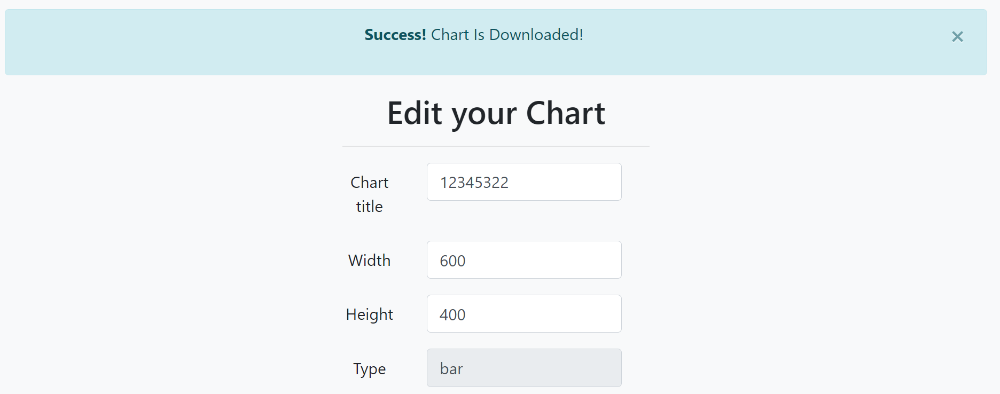
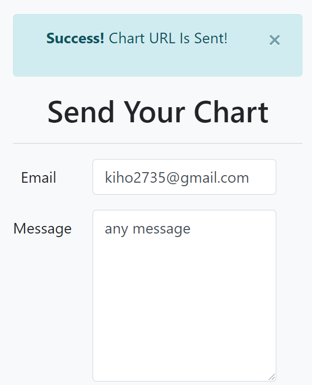
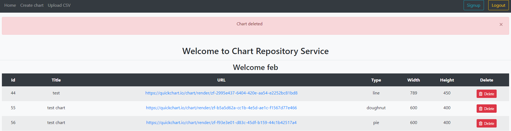

# SOEN-487-A3

Web-Application that integrates the QuickChart API and allows a client to create a custom chart. Implements CRUD requests following MVC Pattern and RESTful architecture.Uses Spring security to maintain a secure web service (uses Login/Logout features). Controller allows for Response to return JSON for Postman Requests and HTTP to web browser.

## Created By

Ivan Gerasymenko, Febrian Francione, Kiho Lee

## Built With

- [Java](https://www.java.com/en/) - Backend programming
- [Spring framework](https://spring.io/) - Backend framework (Spring Boot)
- [Spring Security](https://spring.io/projects/spring-security) - Spring Security
- [MySql](https://www.mysql.com/) - Database
- [Maven](https://maven.apache.org/) - Dependency Management
- [Thymeleaf](https://www.thymeleaf.org/) - Front End Templating with HTML and CSS
- [Bootstrap 4](https://getbootstrap.com/) - Responsive Front End CSS framework
- [Font Awesome](https://fontawesome.com/) - Open Source icon set and toolkit

## Installation and Configuration

This maven project is built using Spring Boot. The core framework and additional libraries were generated with Spring initializr.

The additional dependencies added to the pom.xml file are:

- QuickChart
- sendgrid-java
- spring-security-test
- mysql-connector-java

The web service generates charts and uses persistence through MySQL database. In order to connect
to the database and make SQL transactions please use the following configuration settings:

- Hostname: 127.0.0.1
- Port: 3306
- Username: root
- Password: 1234

The Database Schema to create the database and the tables is provided in the file: src/main/java/com/quickChart/persistence/database.sql

You only need to execute the SQL statements in any Database Management system and it will generate the Database.

The Web Service runs on the local port 8080.

To start the service compile and execute the class: QuickChartApplication.java
Once the Spring Boot loads all the executables and launches the Tomcat Server container you can access the main page of the application with the base url: http://localhost:8080/

This will bring you to the login authentication page, where the user needs to provide his credentials to use the services.

The database already comes pre-populated with a demo user, to login please use the following credentials:

- Username: feb
- Password: 1234

## Documentation

Following are the main entry points of the Web Service which are processed by the controller.
These are all Spring Boot Controller methods that route the response to a Thymeleaf View following the MVC pattern.

All the methods produce :

`{MediaType.APPLICATION_JSON_VALUE}`

Base url:

- http://localhost:8080/chart

### Home Page

After logging in the controller returns the view Home with a list of all the user charts and linked urls to view and edit a specific chart

- Request URL: `/`

- Method: `GET`

- URL Params: None

- Data Params: None

- Success Response:

  - Status Code: 200
  - Content : HTML code with a tabular list of charts
    

- Error Response:
  - Status Code: 302
  - Content : Redirect to login if unauthorized access

### Post Form - Chart

When clicking on Create Chart on the navigation bar of the web client, the controller redirects to the View CreateChart with basic form fields of a chart entity

- Request URL: `/PostForm`

- Method: `GET`

- URL Params: None

- Data Params: None

- Success Response:

  - Status Code: 200
  - Content : HTML code with a form and input fields of a chart Entity
    

- Error Response:
  - Status Code: 302
  - Content : Redirect to login if unauthorized access

### Post Form - Dataset

Receives chart entity with pre-populated chart fields and redirects to a dynamic Thymeleaf template based on chart type with the corresponding dataset entity fields.

- Request URL: `/createDataSet`

- Method: `POST`

- URL Params: None

- Data Params: Chart entity:

  ```json
  {
    "title": "title",
    "width": 600,
    "height": 400,
    "type": "bar",
    "labels": ["label1", "label2", "label3"]
  }
  ```

- Success Response:

  - Status Code: 200
  - Content : HTML code with a form and input fields of a chart Entity and Dataset fields
    

- Error Response:

  - Status Code: 302
  - Content : Redirect to login if unauthorized access

- Notes:
  - if there is a RedirectView from the `uploadFile` method, it will take the chart entity generated in from that method and populate the entity conditionally with the CSV data uploaded

### Create Chart

Receives Chart and DataSet entities from the form and calls QuickChart API to generate chart and persists data to database.
It routes to the view Chart with the chart entity object

- Request URL: `/createChart`

- Method: `POST`

- URL Params: None

- Data Params: Chart entity with DataSet entity:
  ```json
  {
    "title": "title",
    "width": 600,
    "height": 400,
    "type": "bar",
    "labels": ["label1", "label2", "label3"],
    "dataSet": {
      "label": "dataset",
      "border_color": "#F28E2B",
      "background_color": "#FFEAD6",
      "borderWidth": 2,
      "data": [45, 23, 76]
    }
  }
  ```
- Success Response:

  - Status Code: 200
  - Content : HTML code with the chart image and url from QuickChart API
    

- Error Response:
  - Status Code: 302
  - Content : Redirect to login if unauthorized access

### Upload CSV data

When user clicks Upload CSV he is redirected to the UploadFile form, which is the same as the CreateChart form.
The difference is that here all the labels and data will be uploaded directly from a CSV file

- Request URL: `/upload`

- Method: `POST`

- URL Params: None

- Data Params: Chart entity with CSV multipart param:

  ```json
  {
    "title": "title",
    "width": 600,
    "height": 400,
    "type": "bar"
  }
  ```

  `file=[MultipartFile]`

- Success Response:

  - Content : redirects to `/createDataSet` which will populate the Dataset labels and data dynamically from CSV and return HTML form
    

- Error Response:

  - Status Code: 302
  - Content : Redirect to login if unauthorized access

- Notes:
  - The CSV file must have the following format
    - 1 header row with one or more columns with the text \*{[ "label", "value"]}
    - 1 row with one or more columns corresponding to the header \*{[ label, value]}
    - the number of columns must match the number of headers
    - a sample csv file can be found in the documentation folder [CSV file](documentation/upload-data-csv.csv)

### Download Chart

Users can download their own chart image from the view chart among the list of their own charts.
The image file will be downloaded in C:/Users/AppData/Local/Temp/{chart title}.jpg.
If the image name is already existed, the new image will be replaced.

- Request URL: `/downloadChart`

- Method: `POST`

- URL Params:

  Required:

  chartId=[integer]

- Data Params: None

- Success Response:

  - Content : HTML with success message.
    

- Error Response:

  - Status Code: 302
  - Content : Redirect to login if unauthorized access

### Send Chart with Message

If the user chooses a chart among their list of charts, the user can send chart image with message to anyone using SendGrid API.

- Request URL: `/sendGrid`

- Method: `POST`

- URL Params: None

- Data Params: EmailInfo entity:

  ```json
  {
    "emailTo": "title",
    "chartURL": "chart url",
    "msg": "message"
  }
  ```

- Success Response:

  - Content : HTML with success message.
    

- Error Response:

  - Status Code: 302
  - Content : Redirect to login if unauthorized access

- Notes:
  - The SendGrid API must need API-KEY to send.
    - Users need to make their own API-KEY.
    - [SendGrid API](https://sendgrid.com/) - SendGrid API Homepage

### View Chart

Gets the chart entity and populates the model attribute with the chart object. It returns a view with the Chart and Dataset fields populated from the Database.

The form has the options to update the chart, download or send by email.

- Request URL: `/viewChart`

- Method: `GET`

- URL Params:

  Required:

  chartId=[integer]

- Data Params: None

- Success Response:

  - Status Code: 200
  - Content : HTML code with the chart and dataset information and options to update, download and send.

    
    

- Error Response:
  - Status Code: 302
  - Content : Redirect to login if unauthorized access

### Update Chart

Updates chart and dataset in the database and generates a new QuickChart URL for the image

- Request URL: `/updateChart`

- Method: `PUT`

- URL Params: None

- Data Params: Chart entity with DataSet entity:

  ```json
  {
    "chartId": 1,
    "title": "title",
    "width": 600,
    "height": 400,
    "type": "bar",
    "labelsMap": { "1": "label1", "2": "label2", "3": "label3" },
    "dataSet": {
      "datasetId": 1,
      "label": "dataset",
      "border_color": "#F28E2B",
      "background_color": "#FFEAD6",
      "borderWidth": 2,
      "dataMap": { "1": 56, "2": 110, "3": 80 }
    }
  }
  ```

- Success Response:

  - Status Code: 200
  - Content : HTML with the updated chart, dataset and the success message.

    

- Error Response:
  - Status Code: 302
  - Content : Redirect to login if unauthorized access

### Delete Chart

Deletes the chart from the Database and returns to home page without the deleted chart in the table

- Request URL: `/deleteChart`

- Method: `DELETE`

- URL Params:

  Required:

  chartId=[integer]

- Data Params: None

- Success Response:

  - Status Code: 200
  - Content : HTML code without the chart deleted. A success message will display if deleted

    

- Error Response:
  - Status Code: 302
  - Content : Redirect to login if unauthorized access

## JSON Controller Documentation

Following are the main entry points of the Web Service which are processed by the JSON controller.
This is to be used by an external thin web service client such as Postman, Curl, Terminal or any other.

All the methods produce :

`{MediaType.APPLICATION_JSON_VALUE}`

All the methods accept :

`{MediaType.APPLICATION_JSON_VALUE}`

Base url:

- http://localhost:8080/chart/json

### Get All Charts

Users can get all their charts.

- Request URL: `/`

- Method: `GET`

- URL Params: None

- Data Params: None

- Success Response:

  - Status Code: 200
  - Content : A JSON array of charts

  ```json
  [
    {
      "chartId": 44,
      "title": "test",
      "width": 789,
      "height": 450,
      "type": "line",
      "labels": [],
      "dataSet": null,
      "chartUrl": "https://quickchart.io/chart/render/zf-2995e437-6404-420e-aa54-e2252bc81bd8",
      "labelsMap": {}
    },
    {
      "chartId": 55,
      "title": "test chart",
      "width": 600,
      "height": 400,
      "type": "doughnut",
      "labels": [],
      "dataSet": null,
      "chartUrl": "https://quickchart.io/chart/render/zf-b5a5d62a-cc1b-4e5d-ae1c-f1567d77e466",
      "labelsMap": {}
    }
  ]
  ```

### Get Chart using ID

Get a specific chart using chart ID.

- Request URL: `/viewChart`

- Method: `GET`

- URL Params: None

- Data Params:

  Required:

  chartId=[integer]

- Success Response:

  - Status Code: 200
  - Content : A JSON representation of Chart and Dataset

  ```json
  {
    "chartId": 71,
    "title": "test chart",
    "width": 600,
    "height": 400,
    "type": "bar",
    "labels": ["labelx", "labely", "labelz"],
    "dataSet": {
      "datasetId": 67,
      "data": [],
      "label": "bar dataset",
      "border_color": "#f28e2b",
      "background_color": "#ffead6",
      "fill": true,
      "borderWidth": 2,
      "pointRadius": 3,
      "showLine": true,
      "backgroundColors": [],
      "dataMap": {
        "225": 56,
        "226": 122,
        "227": 44
      },
      "backgroundColorMap": {}
    },
    "chartUrl": "https://quickchart.io/chart/render/zf-48f27f47-e6d8-4cb1-a2e5-45c42acc1f9c",
    "labelsMap": {
      "240": "labelx",
      "241": "labely",
      "242": "labelz"
    }
  }
  ```

- Error Response:
  - Status Code: 404
  - Content : Chart with chart ID not found!

### Create a New Chart

Create a new chart sent as JSON format data.

- Request URL: `/createChart`

- Method: `POST`

- URL Params: None

- Data Params:

  Bar Type Chart:

  ```json
  {
    "title": "postman chart",
    "width": 900,
    "height": 800,
    "type": "bar",
    "labels": ["label1", "label2", "labelz"],
    "dataSet": {
      "data": [56, 120, 45],
      "label": "postman dataset",
      "border_color": "#f22ce1",
      "background_color": "#ffdbfc",
      "borderWidth": 8
    }
  }
  ```

  Line Type Chart:

  ```json
  {
    "title": "test",
    "width": 789,
    "height": 450,
    "type": "line",
    "labels": ["label1", "label2", "label3", "label4"],
    "dataSet": {
      "data": [120, 85, 40, 96],
      "label": "color set",
      "border_color": "#5cb85c",
      "background_color": "#d0f2cf",
      "fill": true,
      "borderWidth": 5,
      "pointRadius": 10,
      "showLine": true
    }
  }
  ```

  Pie or Doughnut Type Chart:

  ```json
  {
    "title": "pie chart",
    "width": 789,
    "height": 450,
    "type": "pie",
    "labels": ["label1", "label2", "label3", "label4"],
    "dataSet": {
      "data": [120, 85, 40, 96],
      "label": "color set",
      "borderWidth": 5,
      "backgroundColors": ["#4a449f", "#a195b8", "#7dc15a", "#12d879"]
    }
  }
  ```
  
- Success Response:

  - Status Code: 200
  - Content :
    
        Successfully created new chart
        Chart URL: https: //quickchart.io/chart/render/zf-439b0cc1-67fb-4b3d-b8fc-fe32c0d15810

- Error Response:
  - Status Code: 404
  - Content : The chart entity is empty, please provide the JSON chart structure


### Update a Chart

Update an existing chart sent as JSON format data.

- Request URL: `/updateChart`

- Method: `PUT`

- URL Params: None

- Data Params:

  Bar Type Chart with the IDs set for each data and map:

  ```json
  {
    "chartId": 71,
    "title": "update chart",
    "width": 600,
    "height": 400,
    "type": "bar",
    "dataSet": {
      "datasetId": 67,
      "label": "bar dataset",
      "border_color": "#f28e2b",
      "background_color": "#ffead6",
      "borderWidth": 2,
      "dataMap": {
        "225": 56,
        "226": 122,
        "227": 44
      }
    },
    "labelsMap": {
      "240": "labelx",
      "241": "labely",
      "242": "labelz"
    }
  }
  ```

  Line Type Chart with the IDs set for each data and map:

  ```json
  {
    "chartId": 71,
    "title": "test chart",
    "width": 600,
    "height": 400,
    "type": "line",
    "dataSet": {
      "datasetId": 67,
      "label": "bar dataset",
      "border_color": "#f28e2b",
      "background_color": "#ffead6",
      "fill": true,
      "borderWidth": 2,
      "pointRadius": 3,
      "showLine": true,
      "dataMap": {
        "225": 56,
        "226": 122,
        "227": 44
      }
    },
    "labelsMap": {
      "240": "labelx",
      "241": "labely",
      "242": "labelz"
    }
  }
  ```

  Pie or Doughnut Type Chart with the IDs set for each data and map:

  ```json
  {
    "chartId": 71,
    "title": "test chart",
    "width": 600,
    "height": 400,
    "type": "doughnut",
    "dataSet": {
      "datasetId": 67,
      "label": "bar dataset",
      "borderWidth": 2,
      "dataMap": {
        "225": 56,
        "226": 122,
        "227": 44
      },
      "backgroundColorMap": {
        "69": "#4a449f",
        "70": "#a195b8",
        "71": "#7dc15a"
      }
    },
    "labelsMap": {
      "240": "labelx",
      "241": "labely",
      "242": "labelz"
    }
  }
  ```

- Success Response:

  - Status Code: 200
  - Content :
    
        Successfully updated new chart
        Chart URL: https: //quickchart.io/chart/render/zf-439b0cc1-67fb-4b3d-b8fc-fe32c0d15810

- Error Response:
  - Status Code: 404
  - Content : 
      
        Failed to update chart or dataset

  
### Delete Chart

Delete a chart using chart ID.

- Request URL: `/deleteChart`

- Method: `DELETE`

- URL Params:

  Required:

  chartId=[integer]

- Data Params: None

- Success Response:

  - Status Code: 200
  - Content : Successfully deleted chart with chart ID

- Error Response:
  - Status Code: 400
  - Content : Chart ID has not been found


### Send chart to email

Sends chart as email with Sendgrid

- Request URL: `/sendGrid`

- Method: `POST`

- URL Params: None

- Data Params:

      EmailInfo:

  ```json
  {
    "emailTo": "user@gmail.com",
    "chartUrl": "https://quickchart.io/chart/render/zf-48f27f47-e6d8-4cb1-a2e5-45c42acc1f9c",
    "msg": "body message of email"
  }
  ```

- Success Response:

  - Status Code: 200
  - Content : mail has been sent check your inbox.
  

- Error Response:
  - Status Code: 400
  - Content : The email info entity is empty, please provide the JSON email data structure


## UML Diagrams

Following are the UML diagrams and the Sequence Diagrams of the Service API


### Sequence Diagrams

The following sequence diagram depicts the flow when the external web service is called by the
application back-end.


The action is: updating an existing Bar chart from the view.


  
  
  
  Business Function: Create a chart
  
  


## License

This project is licensed under the GNU General Public License v3.0 - see the [LICENSE.md](LICENSE) file for details
